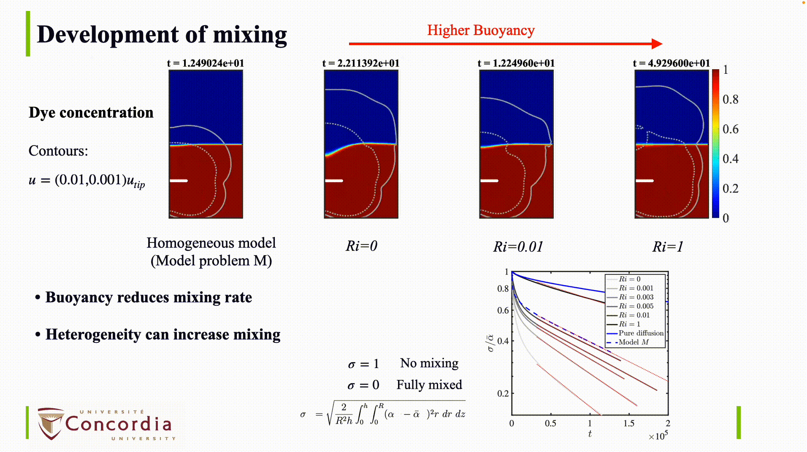
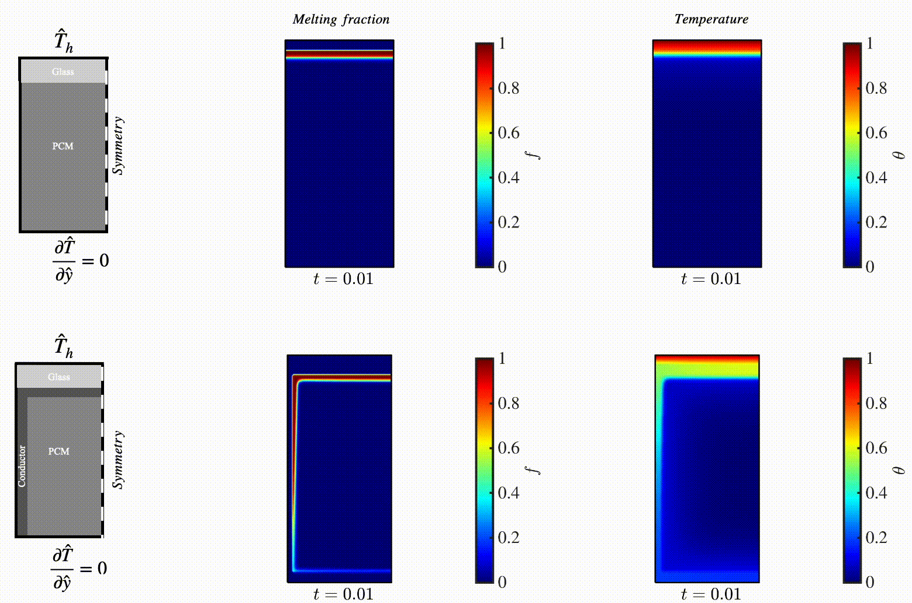
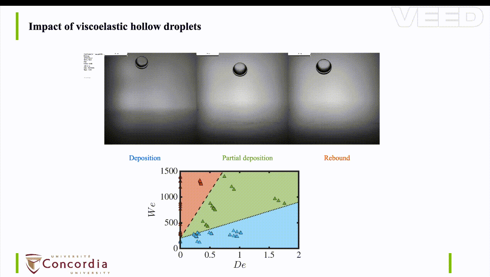
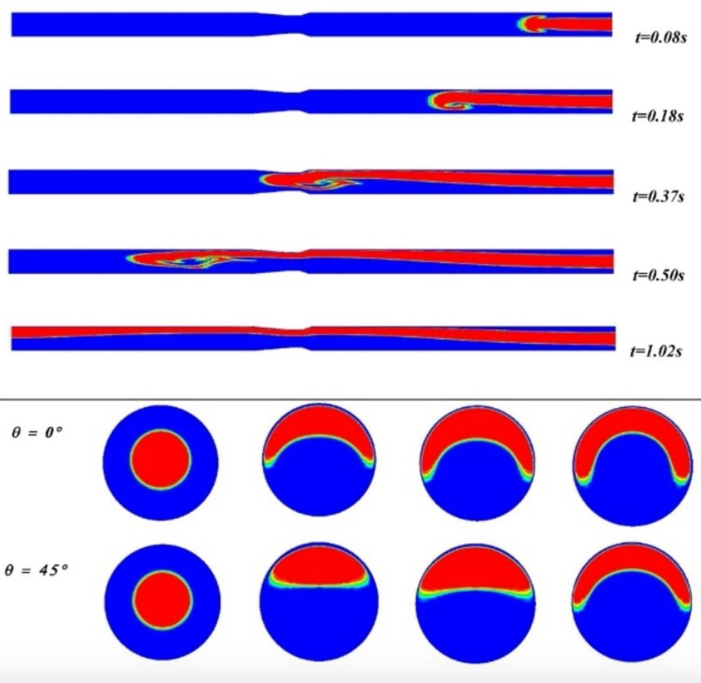

## Research

  

    I am a fluid mechanician with a strong foundation in computational fluid dynamics and applied mathematics. I develop simplified model problems that capture the essential physics of real-world and industrial systems, with particular interest in <strong>non-Newtonian</strong>, <strong>multiphase</strong>, <strong>turbulent</strong>, and <strong>heat transfer</strong> phenomena.
  

  

    I am also interested in <strong>reinforcement learning</strong>, <strong>data-driven modeling</strong>, <strong>reduced-order representations</strong>, and <strong>learning-based control of physical systems</strong>.
  

--

### Mixing localization in yield-stress fluids

We explore the mechanisms and regimes of mixing in yield-stress fluids by simulating the stirring of an infinite, two-dimensional domain filled with a Bingham fluid. A cylindrical stirrer moves along a circular path at constant speed to stir the fluid, with an initially quiescent domain marked by a passive dye in the lower half, facilitating the analysis of dye interface evolution and mixing dynamics. We first examine the mixing process in Newtonian fluids, identifying three key mechanisms: interface stretching and folding around the stirrer’s path, diffusion across streamlines, and dye advection and interface stretching due to vortex shedding. Introducing yield stress into the system leads to notable localization effects in mixing, manifesting through three mechanisms: advection of vortices within a finite distance of the stirrer, vortex entrapment near the stirrer, and complete suppression of vortex shedding at high yield stresses. Based on these mechanisms, we classify three
distinct mixing regimes in yield-stress fluids: (i) Regime SE, where shed vortices escape the central region, (ii) Regime ST, where shed vortices remain trapped near the stirrer, and (iii) Regime NS, where no vortex shedding occurs. These regimes are quantitatively distinguished through spectral analysis of energy oscillations, revealing transitions and the critical Bingham and Reynolds numbers. The transitions are captured through effective Reynolds numbers, supporting a hypothesis that mixing regime transitions in yield-stress fluids share fundamental characteristics with bluff-body flow dynamics. The findings provide a mechanistic framework for understanding and predicting mixing behaviors in yield-stress fluids, suggesting that the localization mechanisms and mixing regimes observed here are archetypal for stirred-tank applications.

 

*Related publications*
- **M.R. Daneshvar Garmroodi**, & I. Karimfazli (2025). **[Yield-Stress Fluid Mixing: Localization Mechanisms and Regime Transitions]( https://doi.org/10.1017/jfm.2025.10729)**. *Journal of Fluid Mechanics*.
- **M.R. Daneshvar Garmroodi**, & I. Karimfazli (2025). **[Two-dimensional mixing stirred system, mixing regimes and transitions]()**. *Submitted to Physics of Fluids*.

---

### Mixing in heterogeneous non-Newtonian fluids

In this study, primary objective is to emphasize the potential for substantial inaccuracies in predicting mixing outcomes when the effects heterogeneous fluid properties are disregarded. We investigate the homogenization of an additive in a fluid-filled cylindrical tank stirred by an axisymmetric disk, where both fluid rheology and density are contingent on the additive concentration. We introduce and compare two models for predicting mixing development. The first model (model problem T) incorporates variations in fluid properties dependent on the additive concentration, while the second model (model problem M) simplifies the fluid properties to their average values. Our approach to modeling mixing centers on a concentration field governed by advection–diffusion. We illustrate that the mapping between the parameter spaces of the two model problems is far from one-to-one. For any given point in the parameter space of model problem M, three distinct parameter groups (buoyancy, Atwood number, and viscosity ratio) exhibit unconstrained variations within the corresponding subset of the parameter space of model problem T. As a concrete example, we investigate the impact of buoyancy on the evolution of velocity and additive concentration in model problem. Our analysis characterizes the influence of buoyancy on the mixing rate by examining the asymptotic behavior of the concentration field. We find that the standard deviation of the concentration asymptotically converges to an exponential decay, with the intercept and decay rate diminishing as a power-law function of buoyancy. This underscores the significant effect that even slight variations in buoyancy can have on the mixing process. Finally, our results conclusively demonstrate that the recirculation zones, areas where fluid velocity is notable, in model problems M and T do not align.

 

*Related publications*
- **M.R. Daneshvar Garmroodi**, & I. Karimfazli (2024). **[Mixing in heterogeneous fluids: An examination of fluid property variations](https://doi.org/10.1016/j.jnnfm.2024.105196)**. *Journal of non-Newtonian Fluid Mechanics*.

---

### Sparse and Physics-Informed Reconstruction of Fluid Flows

This project explores two fundamentally different approaches for reconstructing high-dimensional fluid flow fields from sparse sensor measurements, using the classic 2D incompressible cylinder wake dataset. The goal is to recover the full velocity and pressure fields from only a limited number of spatial sensors. I implemented and compared a sparse snapshot-based method rooted in compressed sensing theory and a Physics-Informed Neural Network (PINN) approach that enforces the Navier–Stokes equations during training.

The sparse method assumes that any flow snapshot can be represented as a sparse combination of previously observed snapshots. By solving a LASSO optimization problem, the reconstruction selects only a few relevant training snapshots that best match the sensor measurements. This approach is fast, interpretable, and highly accurate when the test flow lies within the span of the training data, but it is fundamentally interpolation-based and does not enforce physical laws.

In contrast, the PINN approach learns a neural network that maps space and time coordinates directly to velocity and pressure while minimizing both data mismatch and the residuals of the governing Navier–Stokes equations. This physics-constrained framework produces smooth, physically consistent reconstructions and can generalize beyond the training snapshots. Comparing these two paradigms highlights the tradeoff between sparse data-driven interpolation and physics-informed learning for reconstructing complex dynamical systems from limited observations.

- The codes and mathematical formulations are available on my **[GitHub](https://github.com/MRDanesh/Sparse_PINNs)**.

    <figure>
      
      <figcaption>Sparse snapshot method (LASSO) result.</figcaption>
    </figure>
    <figure>
      
      <figcaption>PINN (Navier–Stokes) result.</figcaption>
    </figure>

---

### Interpretable Reduced-Order Model for Periodic Flows: POD Oscillators vs DMD

This project compares two classic reduced-order modeling approaches for predicting the 2D cylinder wake flow field from simulation snapshots:

POD-based ROM (4 modes): POD is computed on the training window to obtain dominant spatial modes. 
The corresponding temporal coefficients are modeled as oscillatory signals. 
Two dominant frequencies are estimated from coefficient phase dynamics, and each coefficient is fit with a sinusoidal regression model. 
The predicted coefficients are then used to reconstruct the flow field in the test window.

DMD (rank 4): DMD is trained on the same training window to identify a low-rank linear time-advance model. 
The learned DMD modes and eigenvalues are used to roll out the dynamics and predict the test snapshots directly in the field space.

The goal is to provide a clean, interpretable ROM baseline for periodic flows and a comparison between POD-based coefficient modeling and DMD-based spectral prediction.

- The codes and mathematical formulations are available on my **[GitHub](https://github.com/MRDanesh/POD_DMD)**.

    <figure>
      
      <figcaption>POD prediction.</figcaption>
    </figure>
    
   <figure>
      
      <figcaption>DMD prediction.</figcaption>
    </figure>

---

### Buoyancy-Driven Melting in Phase-Change Materials With Embedded Heat Spreaders

I built a simplified benchmark model to study how embedded high-conductivity inserts can improve heat transport in phase-change materials (PCMs). 
The system is heated from the top at a fixed temperature and insulated at the bottom, mimicking a sink-limited scenario where heat must be redistributed internally rather than rejected externally. 
By testing multiple conductor topologies, I quantify their impact on melting rate, latent heat utilization, and the onset of buoyancy-driven flow in the melted PCM. 
The outcome is a set of design insights for using conductor networks to reduce hot-side temperatures and promote more uniform melting.

To simulate the melting process, an enthalpy based model is developed in OpenFOAM version 7. The solver is validated by previous studies. 
The codes are available on my **[GitHub](https://github.com/MRDanesh/conjugateMeltingFOAM)**.

 

*Related publications*
- **M.R. Daneshvar Garmroodi**, & I. Karimfazli . **Enhancement of buoyancy-driven melting**. *Under preparation*.

---

### From Jet Collision to Emulsion Quality: Nozzle Dynamics and Mixing development

Efficient conditioning of oil-based drilling fluids (OBMs) is essential for maintaining stable rheological and dispersion properties during offshore drilling operations. Recently, the dual shear gun has been proposed as a compact, high-throughput device for rapid drilling-fluid conditioning through a combination of intense nozzle-scale shearing and downstream jet mixing. Despite promising experimental demonstrations, a predictive framework linking operating conditions to emulsion refinement within the device remains lacking.
In this study, we develop a nozzle-resolved numerical model to investigate the hydrodynamics and emulsion droplet breakup occurring in the converging nozzle of a dual shear gun. The flow is modeled as turbulent and axisymmetric, with the drilling fluid represented by a Herschel-Bulkley constitutive law. A pressure-driven formulation is employed to examine how the imposed pressure drop across the nozzle influences velocity fields, shear rates, and turbulent dissipation. The Kolmogorov-Hinze framework is then used to estimate breakup-limited droplet sizes as a function of radial position.
The results show that, while increasing pressure drop enhances near-wall shear rates, the overall mean flow structure remains broadly similar across operating conditions. Consequently, single-pass droplet refinement exhibits only modest sensitivity to pressure drop. To capture the cumulative effect of conditioning, we introduce an iterative, flow-weighted model that tracks the evolution of the droplet-size contribution over successive circulations through the nozzle. The model predicts that repeated passes progressively suppress larger droplets, leading to a reduction of the mean characteristic droplet size by an order of magnitude after only a few circulations.

An eddy-viscosity turbulence solver is developed in OpenFOAM, to model viscoplastic turbulent flows.
The turbulence model is previously derived by **[Lovato et al](https://doi.org/10.1016/j.jnnfm.2021.104729)**. The developed solver and validation case is available in my **[GitHub](https://github.com/MRDanesh/non-Newtonian-RANS)**.

*Related publications*
- **M.R. Daneshvar Garmroodi**, & I. Karimfazli (2026). **A Novel Itterative Method to Enhance Emulsion Quality in Non-Newtonian Fluids**. *Journal paper under preparation*.
- **M.R. Daneshvar Garmroodi**, & I. Karimfazli (2026). **From Jet Collision to Emulsion Quality: Nozzle Dynamics**. *45th International Conference on Ocean, Offshore and Arctic Engineering*.
- **M.R. Daneshvar Garmroodi**, & I. Karimfazli (2026). **From Jet Collision to Emulsion Quality: Fluid Mixing**. *45th International Conference on Ocean, Offshore and Arctic Engineering*.

---

### Viscoelastic hollow droplets

The impact dynamics of hollow droplets, while critical in applications like coating and spraying, remain less explored than their dense counterparts, particularly for non-Newtonian fluids. 
This work presents an experimental investigation into the impact of hollow Newtonian (water) and viscoelastic (polymeric solution) droplets on a solid surface. 
We demonstrate two hallmark features of hollow droplet flattening: the formation of a central counter-jet and the final deposition, both stemming from the rupture of an entrapped air bubble. For Newtonian impacts, the counter-jet exhibits rapid growth and breakup due to capillary instabilities. 
Introducing polymer additives fundamentally alters this behavior: viscoelasticity suppresses the counter-jet's height and velocity due to enhanced viscous dissipation, delays bubble rupture, and inhibits droplet detachment. 
Crucially, we observe the emergence of beads-on-a-string structures during filament thinning, a signature of the competition between elastic and capillary forces. 
By systematically varying the polymer concentration and impact velocity, we construct a regime map (deposition, partial deposition, rebound) in the Weber–Deborah number phase space. Our results elucidate the intricate interplay between inertia, viscosity, capillarity, and elasticity that governs the splashing morphology of hollow non-Newtonian droplets.

 

*Related publications*
- M.M. Nasiri, **M.R. Daneshvar Garmroodi**, D.C. Vadillo, & M. Tembely (2025). **Experimental study of polymer hollow droplet impact**. *submitted to Physics of Fluids*.

---

### Transporting waxy crude oil/water in core-annular and stratified regimes

In this work, 3D numerical study has been performed to investigate the core-annular and stratified flows of waxy crude oil/water in inclined pipes with a gradual expansion. Waxy crudes are highly viscous crude oils which exhibit non-Newtonian flow behavior, and their efficient transportation is still a technical challenge. The use of the core-annular and stratified methods for the transportation of waxy crude is examined comprehensively where the core oil flows in the laminar flow regime, and the water flow field is turbulent. The volume of fluid multiphase flow model is used to capture the oil/water interface and RANS turbulence model has been employed to predict the turbulent features of the water flow field. The oil has been considered as a viscoplastic fluid in the core annular regim in an inclined pipe. The effects of several parameters during transporting oil, such as wax content of the crude oil, inlet velocities, expansion angle, and inclination angle of the pipe have been investigated comprehensively. The results revealed that in core-annular regime, as the wax content of the crude oil increased, the pressure drop along the pipeline did not change, and using the core-annular regime became more economical in comparison to single-phase oil flow. The simulation results also showed that increasing the expansion angle in the core-annular regime from 3.7 to 45 can increase overall pressure drop more than fourfold. Furthermore, it is found that transporting waxy crude in higher oil velocities can be more economical. Finally, it is shown that for downward flow, by increasing the inclination angle, overall pressure drop monotonically decreased. However, in upward flow, the overall pressure drop profile as a function of the inclination angle had a local maximum of around 45.

 

*Related publications*
- **M.R. Daneshvar Garmroodi**, & A. Ahmadpour (2020). **[A numerical study on two-phase core-annular
flows of waxy crude oil/water in inclined pipes](https://doi.org/10.1016/j.cherd.2020.04.017)**. *Chemical Engineering Research and Design*.
- **M.R. Daneshvar Garmroodi**, & A. Ahmadpour (2020). **[A numerical study on two-phase core-annular
flows of waxy crude oil/water in inclined pipes](https://doi.org/10.1016/j.petrol.2020.107458)**. *Journal of Petroleum Science and Engineering*.

