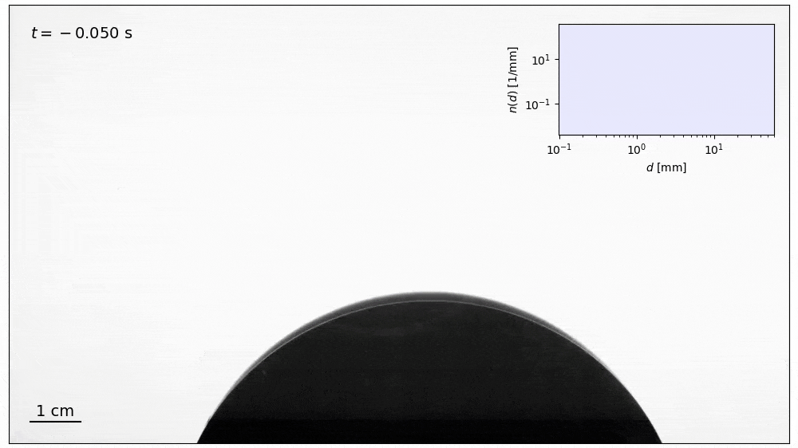
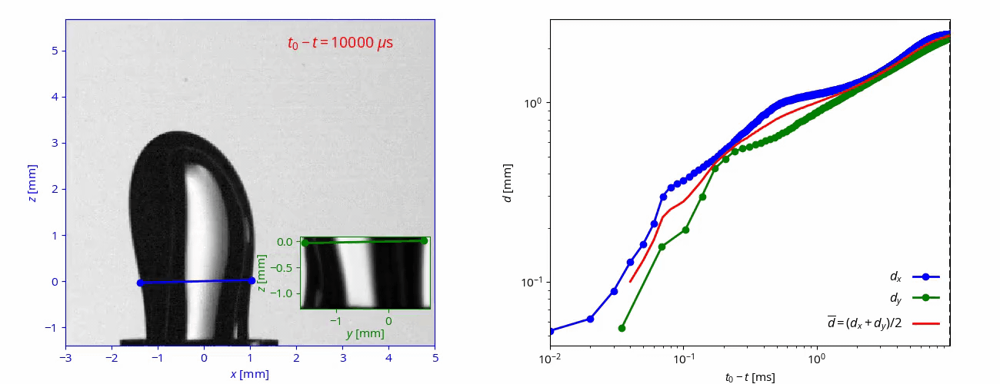
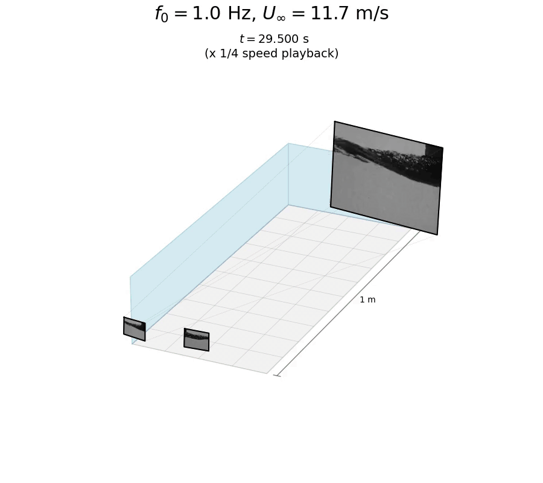

## Research

I am a Postdoctoral Researcher in [Ida Karimfazli Group](https://users.encs.concordia.ca/~idak/). During my PhD, I studied the mixing dynamics of **viscoplastic fluids**.

I am interested in studying **non-Newtonian**, **multiphase**, and **turbulent flows** both **experimentally** and **numerically**.

---

### Mixing localization in yield-stress fluids

We explore the mechanisms and regimes of mixing in yield-stress fluids by simulating the stirring of an infinite, two-dimensional domain filled with a Bingham fluid. A cylindrical stirrer moves along a circular path at constant speed to stir the fluid, with an initially quiescent domain marked by a passive dye in the lower half, facilitating the analysis of dye interface evolution and mixing dynamics. We first examine the mixing process in Newtonian fluids, identifying three key mechanisms: interface stretching and folding around the stirrer’s path, diffusion across streamlines, and dye advection and interface stretching due to vortex shedding. Introducing yield stress into the system leads to notable localization effects in mixing, manifesting through three mechanisms: advection of vortices within a finite distance of the stirrer, vortex entrapment near the stirrer, and complete suppression of vortex shedding at high yield stresses. Based on these mechanisms, we classify three
distinct mixing regimes in yield-stress fluids: (i) Regime SE, where shed vortices escape the central region, (ii) Regime ST, where shed vortices remain trapped near the stirrer, and (iii) Regime NS, where no vortex shedding occurs. These regimes are quantitatively distinguished through spectral analysis of energy oscillations, revealing transitions and the critical Bingham and Reynolds numbers. The transitions are captured through effective Reynolds numbers, supporting a hypothesis that mixing regime transitions in yield-stress fluids share fundamental characteristics with bluff-body flow dynamics. The findings provide a mechanistic framework for understanding and predicting mixing behaviors in yield-stress fluids, suggesting that the localization mechanisms and mixing regimes observed here are archetypal for stirred-tank applications.

 

*Related publications*
- **M.R. Daneshvar Garmroodi**, & I. Karimfazli (2025). **[Yield-Stress Fluid Mixing: Localization Mechanisms and Regime Transitions](https://arxiv.org/pdf/2503.09359)**. *Accepted for publication by the Journal of Fluid Mechanics*.

---

### Turbulent break-up of bubbles

In a turbulent flow, bubbles will break apart due to stresses from the surrounding turbulent liquid if they are large enough that surface tension is incapable of preventing severe deformations. Knowledge of the **dynamics of the break-ups** and the **distribution of bubble sizes** that are produced is important to modeling bubble-mediated gas transfer, as occurs with breaking waves on the ocean and in industrial bubble column reactors.

 

<!---
The animation above shows the break-up of a bubble that is initially much larger than the scale at which surface tension could counteract turbulent stresses.
--->

*Related publications*
-  **Ruth, D.**, Aiyer, A., Rivière, A., Perrard, S., and Deike, L. (2022). **[Experimental observations and modeling of sub-Hinze bubble production by turbulent bubble break-up](https://www.cambridge.org/core/journals/journal-of-fluid-mechanics/article/experimental-observations-and-modelling-of-subhinze-bubble-production-by-turbulent-bubble-breakup/B1978FC9D3E60B90B943458B92C5D08C)**. *Journal of Fluid Mechanics*, 951, A32.
-  Rivière, A., **Ruth, D. J.**, Mostert, W., Deike, L., & Perrard, S. (2022). **[Capillary driven fragmentation of large gas bubbles in turbulence](https://journals.aps.org/prfluids/abstract/10.1103/PhysRevFluids.7.083602)**. *Physical Review Fluids*, 7(8), 083602.

---

### Bubble rise dynamics in turbulence

The speed at which bubbles rise through turbulence affects the time available for their gases to diffuse into the surrounding liquid. We studied this using **stereoscopic imaging** of bubbles in a laboratory turbulent flow (shown below) and **[point-particle simulations](./code) of bubbles in homogeneous, isotropic turbulence**.

*Related publications*
- **Ruth, D. J.**, Vernet, M., Perrard, S., & Deike, L. (2021). **[The effect of nonlinear drag on the rise velocity of bubbles in turbulence](https://www.cambridge.org/core/journals/journal-of-fluid-mechanics/article/effect-of-nonlinear-drag-on-the-rise-velocity-of-bubbles-in-turbulence/38BB9CF85C4A18A99220C901EA47B35D)**. *Journal of Fluid Mechanics*, 924.

---

### Pinch-off of air bubbles deformed by tubulence

Bubbles broken apart by turbulence can adopt **significantly deformed shapes** during the break-up process. Here, we showed that turbulent deformations to a bubble pinching off from a needle can **persist throughout the pinch-off process**, even when the scale of the collapsing neck shrinks below the turbulent scales.

 

 

*Related publications*
- **Ruth, D. J.**, Mostert, W., Perrard, S., & Deike, L. (2019). **[Bubble pinch-off in turbulence](https://www.pnas.org/content/116/51/25412.short)**. *Proceedings of the National Academy of Sciences*, 116(51), 25412-25417.

---

### Air entrainment by breaking waves

Breaking waves entrain air bubbles under the ocean surface, which enhance the flux of mass between the ocean and atmosphere. We studied air entrainment in a **wind-wave channel** (in which water waves are created by the combined action of a mechanical wavemaker and air blowing over the water surface). The video below shows a **three-dimensional reconstruction** of the **bubble trajectories** underwater, obtained with the images recorded from two side-by-side cameras shown in the foreground (one of which is enlarged for clarity in the background).

 

*Related publications*
- **Ruth, D. J.**, Néel, B., Erinin, M. A., Mazzatenta, M., Jaquette, R., Veron, F., & Deike, L. (2022). **[Three‐dimensional measurements of air entrainment and enhanced bubble transport during wave breaking](https://agupubs.onlinelibrary.wiley.com/doi/abs/10.1029/2022GL099436)**. *Geophysical Research Letters*, e2022GL099436.
- Erinin, M. A., Néel, B., **Ruth, D. J.**, Mazzatenta, M., Jaquette, R. D., Veron, F., & Deike, L. (2022). **[Speed and Acceleration of Droplets Generated by Breaking Wind‐Forced Waves](https://agupubs.onlinelibrary.wiley.com/doi/abs/10.1029/2022GL098426)**. *Geophysical Research Letters*, 49(13), e2022GL098426. 
